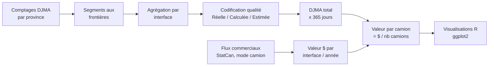

# Valeur Économique du Camionnage Interprovincial Canadien

Relier le **trafic routier mesuré** aux **flux commerciaux monétaires** entre provinces
canadiennes, pour estimer la **valeur moyenne des marchandises transportées par camion** à
chaque frontière interprovinciale — et visualiser comment cette valeur évolue dans le temps et
se compose par type de marchandise.

> L'idée centrale : un poste de comptage routier dit *combien de camions* traversent une
> frontière ; une table économique dit *combien de dollars* de marchandises traversent la même
> frontière. En les faisant correspondre au bon niveau géographique (l'**interface**
> interprovinciale), on obtient une estimation de la valeur économique moyenne transportée par
> camion. Ce travail a été réalisé dans le cadre de recherche CIRANO sur le transport routier
> interprovincial canadien.

## Sommaire

1. [Données](docs/donnees.md) — les tables de référence et dérivées, et la codification qualité R/C/E
2. [Méthodologie](docs/methodologie.md) — des routes aux interfaces, du DJMA à la valeur par camion
3. [Résultats](docs/resultats.md) — les 4 graphiques et leur interprétation
4. [Limites et pistes explorées](docs/limites.md) — la piste cartographique abandonnée, la couverture temporelle, les sources manquantes

## Pipeline



Chaque interface interprovinciale (ex. `ON_QC` = frontière Ontario–Québec) regroupe plusieurs
**segments** : les routes précises qui traversent cette frontière (66 segments au total pour 9
interfaces, d'Ouest en Est : `BC_AB → AB_SK → SK_MB → MB_ON → ON_QC → QC_NB → NB_NS → NB_PE →
NS_NL`). Détails dans [Données](docs/donnees.md) et [Méthodologie](docs/methodologie.md).

## Reproduire le pipeline

Ce projet est écrit en R.

```r
install.packages(c(
  "ggplot2", "readxl", "dplyr", "tidyr", "scales",
  "ggalluvial", "showtext", "sysfonts", "here"
))
```

Ouvrir le projet depuis la racine du dépôt (pour que `here::here()` résolve correctement les
chemins), puis :

```r
source("src/figures/graphiques_transport.R")
```

Le script charge les tables depuis `data/master/` et `data/processed/`, génère 4 graphiques, et
les exporte en PNG haute résolution dans `figures/`.

## Structure du projet

```
.
├── docs/                   # documentation détaillée (voir Sommaire)
├── data/
│   ├── raw/                # sources externes non versionnées (voir raw/README.md)
│   ├── master/              # tables de référence : interfaces, segments, DJMA brut
│   └── processed/           # tables dérivées : agrégations et résultat final
├── src/
│   └── figures/
│       └── graphiques_transport.R
├── figures/                  # graphiques exportés (PNG)
├── LICENSE
└── README.md
```

## License

MIT — see [LICENSE](LICENSE).

## Author

**Akram Bouznad** — Research Master's (M.A.Sc.), Industrial Engineering (Data Science),
Polytechnique Montréal / CIRANO.
