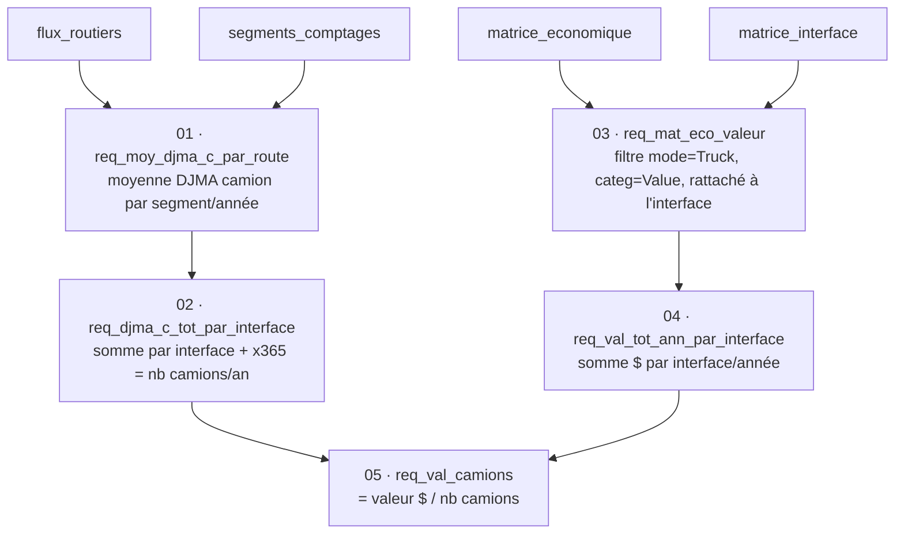

# Base de données

Les tables de [`data/master/`](../data/master/) et [`data/processed/`](../data/processed/) ne
sont pas des fichiers Excel produits à la main : elles proviennent d'une base **Microsoft
Access** (`Master_eco_truck.accdb`) construite pour ce projet, interrogée avec les requêtes SQL
reproduites dans [`sql/`](../sql/). C'est cette partie — modéliser les tables, définir les clés,
écrire les requêtes de jointure/agrégation — qui a pris le plus de temps dans le projet.

Le fichier `.accdb` lui-même (~270 Mo, dominé par la table `matrice_economique`) n'est pas
versionné ; les requêtes ci-dessous en sont l'extraction exacte, et leurs résultats sont les
tables de `data/processed/`.

## Schéma

| Table | Rôle | Lignes |
|---|---|---|
| `interface` | Les 9 interfaces interprovinciales | 9 |
| `matrice_interface` | Directionnalité province origine/destination → interface | 316 |
| `segments_comptages` | Les routes précises qui traversent chaque frontière | 66 |
| `flux_routiers` | DJMA brut par route/année, avec codification qualité | 379 |
| `matrice_economique` | Import brut StatCan (tableau 23-10-0142), tous modes/provinces confondus | 352 326 |

Les 4 premières tables correspondent à `data/master/`. `matrice_economique` est la table brute
avant filtrage — voir [`data/raw/README.md`](../data/raw/README.md) pour la source StatCan.

## Pipeline de requêtes

Les 5 requêtes s'enchaînent dans cet ordre (chacune consomme le résultat de la précédente) :

| # | Requête | Ce qu'elle fait |
|---|---|---|
| 1 | [`req_moy_djma_c_par_route.sql`](../sql/01_req_moy_djma_c_par_route.sql) | Jointure `segments_comptages` × `flux_routiers`, moyenne du DJMA camion par segment/année |
| 2 | [`req_djma_c_tot_par_interface.sql`](../sql/02_req_djma_c_tot_par_interface.sql) | Somme par interface, projection annuelle (×365) |
| 3 | [`req_mat_eco_valeur.sql`](../sql/03_req_mat_eco_valeur.sql) | Filtre `matrice_economique` sur le mode camion, rattaché à l'interface via `matrice_interface` |
| 4 | [`req_val_tot_ann_par_interface.sql`](../sql/04_req_val_tot_ann_par_interface.sql) | Somme $ par interface/année |
| 5 | [`req_val_camions.sql`](../sql/05_req_val_camions.sql) | Jointure des deux branches, division = valeur par camion |

---
[← Données](donnees.md) · [Retour au sommaire](../README.md) · [Suite : Méthodologie →](methodologie.md)
