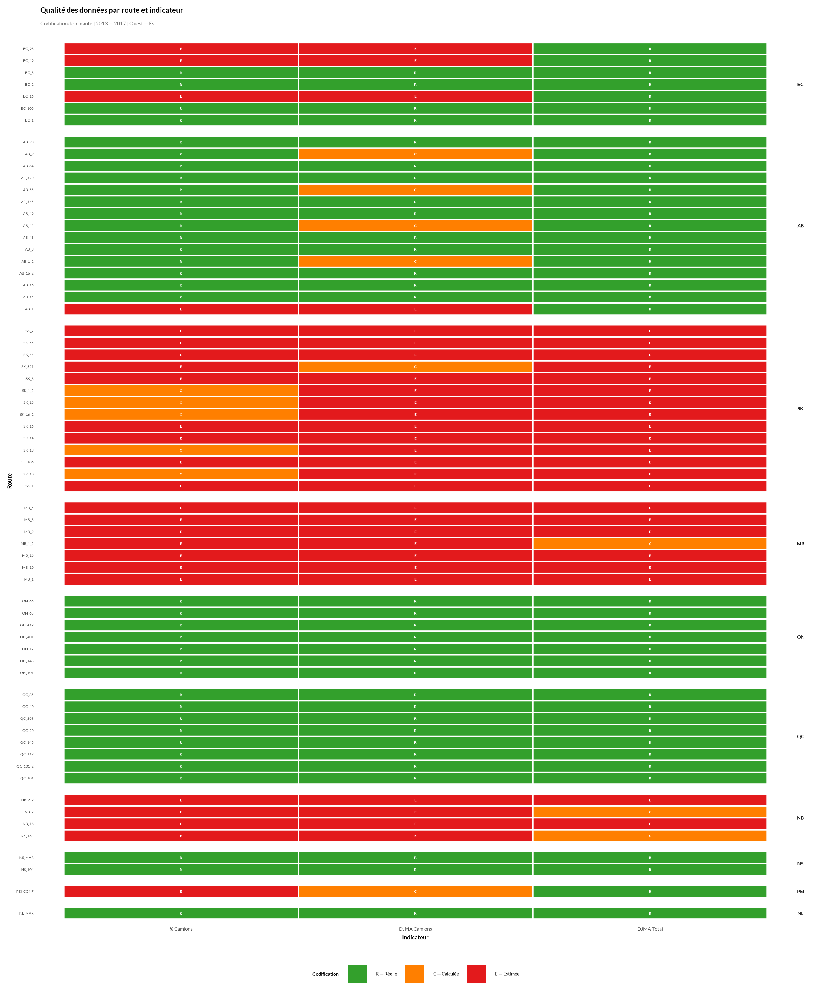
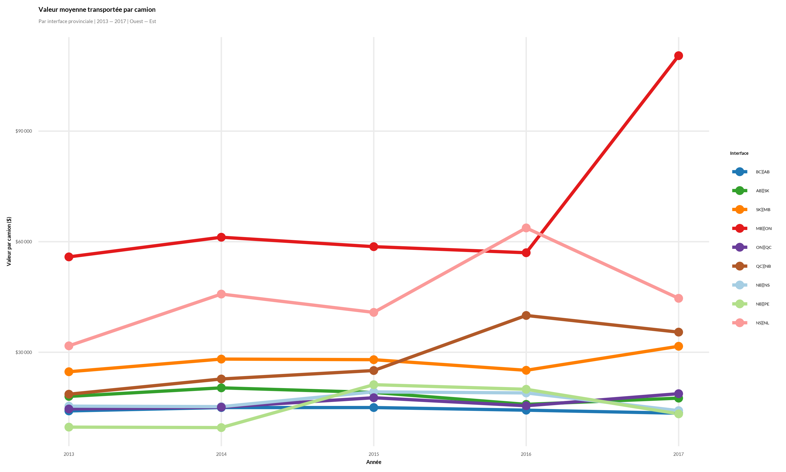
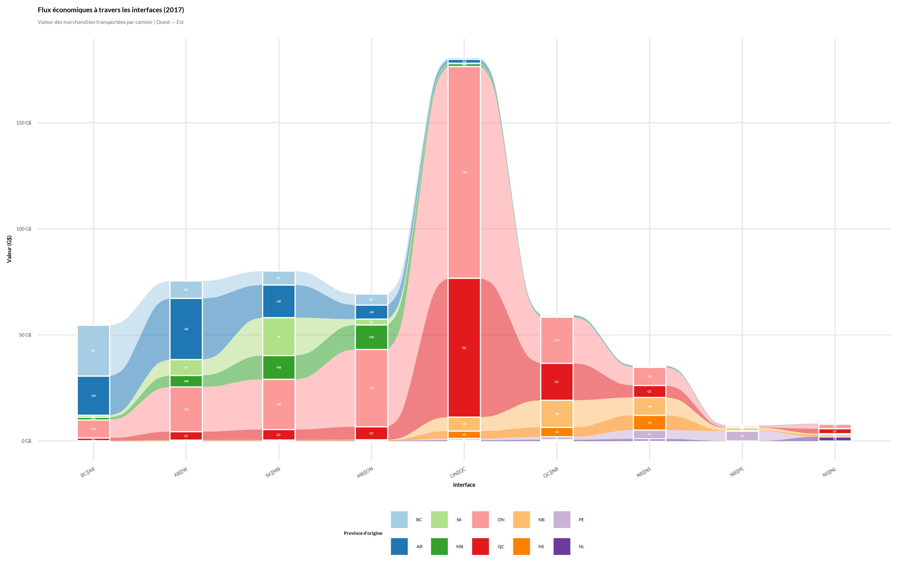
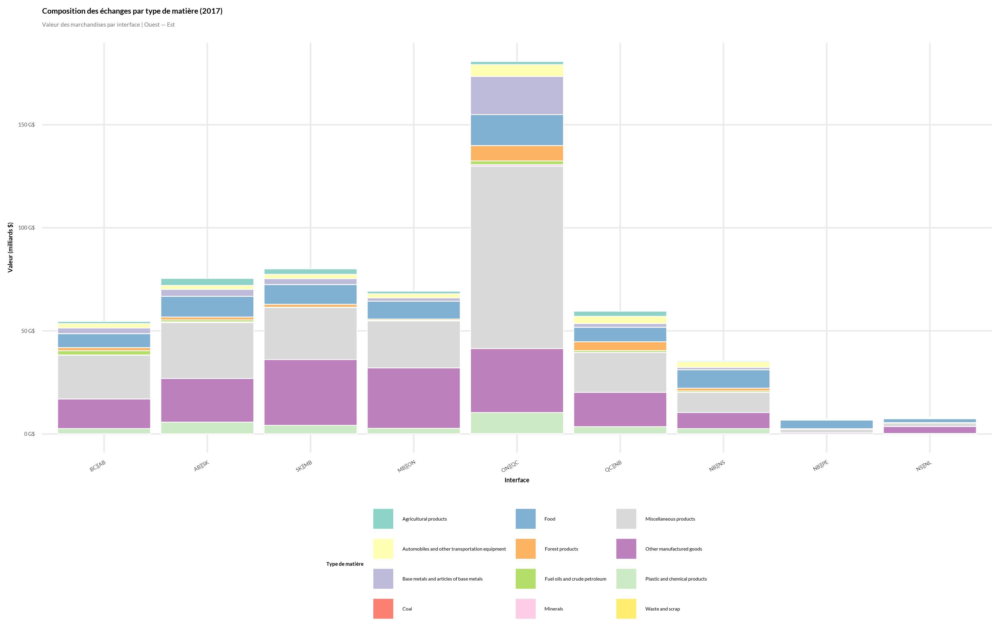

# Résultats

Les 4 graphiques sont générés par [`src/figures/graphiques_transport.R`](../src/figures/graphiques_transport.R)
et exportés dans [`figures/`](../figures/).

## Qualité des données par route et indicateur

La fiabilité des comptages varie fortement par province. L'Ontario, le Québec, la
Nouvelle-Écosse et Terre-Neuve-et-Labrador reposent presque entièrement sur des mesures
**réelles**. À l'inverse, la Saskatchewan, le Manitoba et le Nouveau-Brunswick n'ont
quasiment aucune donnée réelle sur le DJMA camion — tout y est **estimé**. Cette asymétrie
signifie que la précision de la valeur par camion (section suivante) n'est pas uniforme d'une
interface à l'autre : `SK_MB` et `MB_ON` reposent sur des DJMA camions largement estimés,
alors que `ON_QC` repose sur des comptages réels des deux côtés.

## Valeur moyenne transportée par camion

L'interface `MB_ON` (Manitoba–Ontario) se distingue nettement, avec un bond marqué en 2017.
`NS_NL` (le lien maritime Nouvelle-Écosse/Terre-Neuve, traversier Marine Atlantique) est la
deuxième plus élevée mais volatile d'une année à l'autre — cohérent avec un lien unique à faible
volume, plus sensible aux variations d'une grosse cargaison. La majorité des autres interfaces
se regroupent sous 20 000 $/camion, avec une légère tendance à la hausse pour `QC_NB` sur la
période.

## Flux économiques à travers les interfaces

L'interface `ON_QC` domine très largement le volume total de valeur échangée (plus de 180 G$ en
2017) — cohérent avec le fait qu'Ontario et Québec sont les deux économies provinciales les plus
importantes du pays. Le contraste avec le graphique précédent est instructif : `ON_QC` a un
**volume** énorme mais une valeur **par camion** relativement modeste, alors que `MB_ON` a un
volume beaucoup plus faible mais la valeur par camion la plus élevée — deux interfaces très
différentes dans leur profil économique, que la seule mesure du DJMA total ne distinguerait pas.

## Composition des échanges par type de marchandise

Les *Miscellaneous products* et *Other manufactured goods* dominent la plupart des interfaces,
en particulier `ON_QC`. Les interfaces maritimes de l'Est (`NB_PE`, `NS_NL`) se distinguent par
un volume total beaucoup plus faible et une composition différente — `NB_PE` en particulier a une
proportion notable de la catégorie *Food*, cohérent avec le poids de l'agriculture
(pomme de terre) dans l'économie de l'Île-du-Prince-Édouard.

---
[← Méthodologie](methodologie.md) · [Retour au sommaire](../README.md) · [Suite : Limites →](limites.md)
